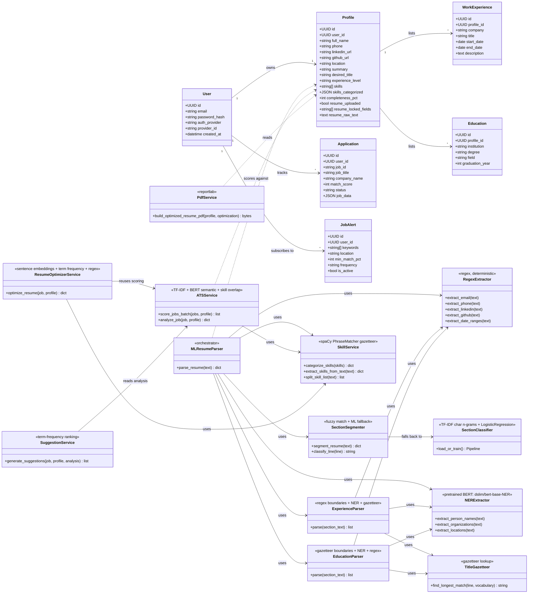

# System Class Diagram

Two parts: the **domain model** (SQLAlchemy ORM entities and their
relationships) and the **algorithmic service layer** (the non-prompting
parsing/scoring/optimization modules), with each service annotated by the
algorithm it implements — consistent with [SEQUENCE_DIAGRAM.md](SEQUENCE_DIAGRAM.md).

## Notes for the report

- **Domain model** classes map 1:1 to PostgreSQL tables (SQLAlchemy `Base`
  subclasses). Relationships shown are foreign-key backed (`ForeignKey` +
  `relationship(...)`), with `Profile → WorkExperience/Education` cascading on
  delete.
- **Service layer** classes are Python modules exposed as static-style
  function collections (not instantiated objects) — represented here as
  classes per UML convention, with each stereotype (`<<...>>`) naming the
  algorithm it implements, matching the Algorithm Index in
  [SEQUENCE_DIAGRAM.md](SEQUENCE_DIAGRAM.md).
- `MLResumeParser` is the only class that writes into the domain model
  (`Profile`); the scoring/optimization classes read `Profile` but never
  mutate it directly — mutation happens explicitly in the router layer after
  the user reviews suggested changes.
